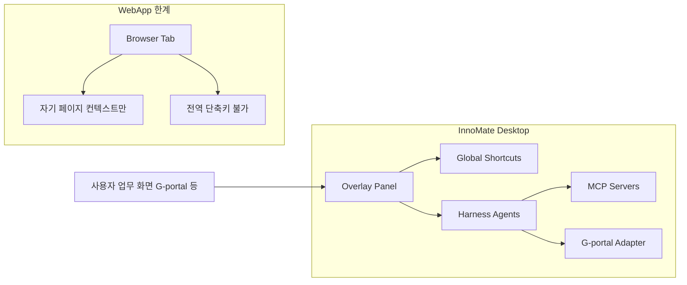
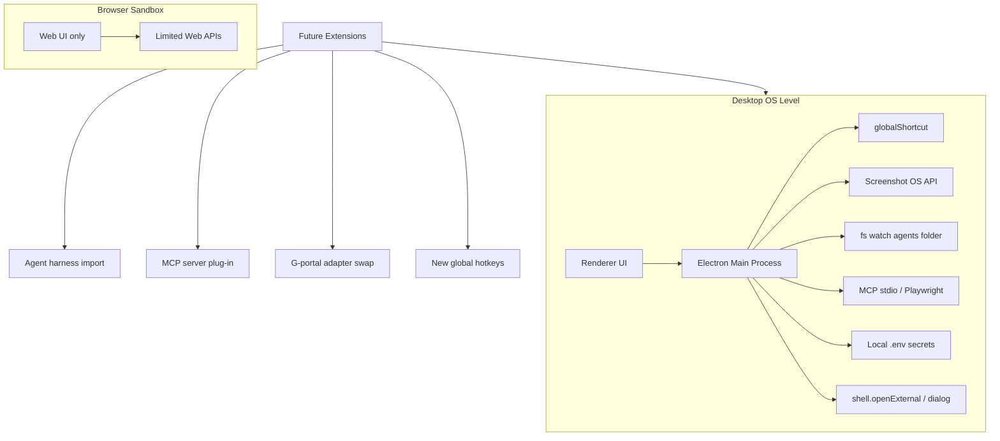

# 데스크톱앱 vs 웹 — 반박법 가이드

InnoMate를 "왜 웹이 아니라 데스크톱앱이냐"고 물을 때 쓸 수 있는 설득 프레임입니다.  
실제 코드베이스(전역 단축키, harness 에이전트 import, Super Agent, MCP, G-portal 로컬 연동)와 **브라우저 샌드박스 vs OS 레벨 확장성** 비교를 근거로 합니다.

---

## 한 줄 답 (엘리베이터 피치)

> **InnoMate는 '웹사이트'가 아니라, 이미 쓰고 있는 G-portal·사내 웹 위에서 돌아가는 업무 실행 레이어입니다. 웹은 탭 안에서만 움직이지만, 데스크톱은 OS 전체(단축키·화면·로컬 에이전트·MCP)를 써서 프롬프트 없이 업무를 끝냅니다.**

---

## 질문의 전제 먼저 뒤집기

상대방이 "웹으로 하면 되지 않나?"라고 할 때, 먼저 이렇게 재정의합니다.

| 상대방이 생각하는 것 | 실제로 필요한 것 |
|---|---|
| 브라우저에서 여는 SaaS | **이미 열려 있는 사내 웹(G-portal 등) 옆에서** 동작하는 코파일럿 |
| 사용자가 ChatGPT처럼 프롬프트 작성 | **사업부·직무별 에이전트를 import**해서 가이드 없이 실행 |
| 하나의 웹 서비스 | **Super Agent + 여러 sub-agent + MCP**를 로컬에서 조합하는 런타임 |

즉, "웹 vs 데스크톱"이 아니라 **"탭 안 도구 vs OS 레벨 업무 실행기"**의 차이입니다.

---

## 5가지 반박 축 (InnoMate 코드베이스 근거 포함)

### 1. "프롬프트 엔지니어링 시간" — 단축키 + 사전 패키징

**반박 논리:** 웹 ChatGPT는 매번 "무엇을, 어떻게" 설명해야 합니다. InnoMate는 **의도 → 실행**까지 클릭/단축키 한 번입니다.

**근거 (이미 구현됨):**

- 전역 단축키: `Cmd+H` 스크린샷, `Cmd+Enter` Agent 실행, `Cmd+R` 초기화 ([`electron/shortcuts.ts`](../electron/shortcuts.ts))
- 에이전트별 `GUIDE.md` + `harness.json`에 도구·모델·시나리오가 미리 정의 ([`agents/super/harness.json`](../agents/super/harness.json))
- Super Agent가 `meeting-room`, `vacation`, `asset-export`로 **위임** — 사용자는 "회의실 예약해줘"만 입력

**한 문장:**

> "웹 AI는 매번 프롬프트를 쓰는 제품이고, InnoMate는 **프롬프트를 에이전트 패키지로 미리 굽는** 제품입니다. 단축키는 그 패키지를 1초 만에 호출하는 트리거입니다."

---

### 2. "Super Agent + 에이전트 import" — 웹 하나로는 조직 확장이 안 됨

**반박 논리:** 사업부·직무마다 필요한 웹/업무가 다릅니다. **에이전트를 import하는 데스크톱 런타임**이면 조직 단위로 확장하고, 웹 SaaS 하나로는 모든 직무를 커버하려다 커스터마이징 지옥이 됩니다.

**근거:**

- `agents/` 폴더에 harness 기반 에이전트 (`super`, `meeting-room`, `vacation`, `asset-export`)
- [`HarnessLoader`](../electron/harness/HarnessLoader.ts): 번들 → `userData/agents`로 seed, **로컬 import/확장**
- UI에서 에이전트 폴더 열기·목록 관리 ([`AgentManagerSheet.tsx`](../src/components/Queue/AgentManagerSheet.tsx))
- Super Agent `delegates` + `tools`로 sub-agent 오케스트레이션

**한 문장:**

> "각 플랫폼·사업부마다 에이전트를 **폴더 하나 import**하면 되는 구조는 웹 SaaS가 아니라 **로컬 에이전트 런타임**에 맞습니다. 웹은 마켓플레이스 UI는 가능해도, 실행·권한·MCP 연결은 결국 클라이언트가 필요합니다."

---

### 3. "MCP + 사내 시스템 연동" — 브라우저 샌드박스 밖

**반박 논리:** MCP 서버·Playwright·로컬 파일·VPN 안의 G-portal은 **브라우저 탭 권한만으로는 불가능하거나 매우 제한적**입니다.

**근거:**

- MCP 서버 저장/연결 테스트 ([`electron/mcp/McpStore.ts`](../electron/mcp/McpStore.ts), [`McpConnectionSheet.tsx`](../src/components/Queue/McpConnectionSheet.tsx))
- G-portal Playwright 어댑터 템플릿 — 로컬 브라우저 자동화 ([`agents/_shared/GPORTAL_PLAYWRIGHT_GUIDE.md`](../agents/_shared/GPORTAL_PLAYWRIGHT_GUIDE.md))
- API 키·G-portal 자격증명은 **로컬 `.env`** ([`electron/envFileStore.ts`](../electron/envFileStore.ts)) — SaaS 서버로 보내지 않음

**한 문장:**

> "MCP와 사내 포털 자동화는 **로컬 프로세스·로컬 자격증명**이 전제입니다. 웹앱으로 하면 키와 세션을 우리 서버에 올리거나, 브라우저 확장+별도 데몬을 또 만들어야 해서 보안 검토만 더 늘어납니다."

---

### 4. "업무 흐름 안에 붙는 UX" — 웹은 탭을 바꿔야 함

**반박 논리:** 사용자는 G-portal·Excel·메일 **그 화면을 보면서** 일합니다. 데스크톱 오버레이 + 전역 단축키는 **컨텍스트 전환 없이** 스크린샷→분석→Agent 실행이 가능합니다.

**근거:**

- OS 레벨 스크린샷 ([`ScreenshotHelper.ts`](../electron/ScreenshotHelper.ts))
- 항상 위 오버레이 창 + `Cmd+B` 표시/숨김
- 창 이동·크기 조절 단축키로 업무 화면 가리지 않게 배치

**한 문장:**

> "웹앱은 '또 하나의 탭'이고, InnoMate는 **지금 보고 있는 업무 화면 옆의 실행 버튼**입니다. 탭 전환 1번 × 하루 50번이면, 그게 곧 생산성 차이입니다."

---

### 5. 브라우저 샌드박스 vs OS 레벨 — 확장성의 본질

**핵심 반박 한 줄:**

> "웹은 **브라우저가 허용한 범위 안**에서만 기능이 늘어나고, 데스크톱은 **OS가 허용하는 범위 전체**로 확장됩니다. InnoMate는 후자라서 에이전트·MCP·자동화·단축키를 **플러그인처럼 계속 붙일 수 있는 실행 플랫폼**입니다."

#### 브라우저 샌드박스가 막는 것

웹앱/PWA는 Same-Origin Policy, 권한 팝업, 탭 격리 때문에 아래가 구조적으로 어렵거나 불가능합니다.

| 영역 | 웹(브라우저) | 왜 막히는가 |
|---|---|---|
| **전역 단축키** | 불가 (자기 탭/확장 한정) | OS 입력 후킹은 브라우저 API 밖 |
| **다른 앱 화면 캡처** | 불가 (자기 탭만, 권한·UX 제약) | 크로스 앱 화면은 샌드박스 위반 |
| **로컬 프로세스 실행** | 불가 | `stdio` MCP, CLI, Playwright 등 실행 불가 |
| **임의 파일·폴더 접근** | File API로 사용자가 고른 파일만 | `userData/agents` 같은 자동 watch/import 불가 |
| **사내 VPN·SSO 세션 재사용** | 쿠키/세션이 탭·도메인에 묶임 | G-portal 등 **이미 로그인된 브라우저 컨텍스트** 공유 어려움 |
| **백그라운드 상시 실행** | 탭 닫히면 종료, Service Worker도 제한 | Agent/MCP 상시 대기 어려움 |
| **시스템 트레이·오버레이** | 제한적 (항상 위, 투명 창 등) | OS 창 관리 API 필요 |
| **네이티브 알림·클립보드·쉘** | 일부 Web API로 가능하나 제한 | 깊은 OS 통합 불가 |

**웹에서 "비슷하게" 하려면:** 브라우저 확장 + 네이티브 메시징 + 별도 로컬 데몬 + 백엔드 서버 → **결국 데스크톱 클라이언트를 우회적으로 다시 만드는 것**.

#### 데스크톱(OS 레벨)이 열어주는 확장 축

InnoMate는 Electron을 통해 **Node.js + Chromium + OS API**를 함께 씁니다. 확장성은 "기능 추가"가 아니라 **새로운 OS 레벨 능력을 붙이는 것**입니다.

#### InnoMate에서 이미 증명된 OS 레벨 확장 포인트

| 확장 축 | OS 레벨 능력 | InnoMate 구현 | 웹만으로 대체 시 |
|---|---|---|---|
| **입력** | 전역 hotkey | `Cmd+H/B/Enter/R` 등 ([`shortcuts.ts`](../electron/shortcuts.ts)) | 확장+Native Host |
| **컨텍스트** | 화면 캡처 | [`ScreenshotHelper`](../electron/ScreenshotHelper.ts) | 권한 지옥, G-portal 캡처 불가 |
| **에이전트** | 로컬 FS read/watch | [`HarnessLoader`](../electron/harness/HarnessLoader.ts), [`HarnessWatcher`](../electron/harness/HarnessWatcher.ts) | 서버 업로드·배포 파이프라인 필요 |
| **도구 연결** | child process / stdio | MCP 서버 연동 ([`McpStore`](../electron/mcp/McpStore.ts)) | 백엔드 프록시 + 보안 검토 |
| **레거시 웹** | Playwright/Chromium | G-portal adapter ([`GPORTAL_PLAYWRIGHT_GUIDE.md`](../agents/_shared/GPORTAL_PLAYWRIGHT_GUIDE.md)) | 서버-side RPA 또는 불가 |
| **비밀정보** | 로컬 파일 | `.env` read/write ([`envFileStore.ts`](../electron/envFileStore.ts)) | SaaS에 키集中 |
| **조직 확장** | 폴더 import | `userData/agents` + UI에서 폴더 열기 | 테넌트별 서버 설정 UI |

#### "확장성"을 이렇게 말하면 설득력 있음

- **웹 SaaS의 확장** = 기능 플래그 + 서버 배포 (중앙에서 통제, 사업부별 커스텀은 느림)
- **데스크톱 런타임의 확장** = 로컬에 capability plug-in (중앙 배포 없이도 현장 확장)

**구체적 확장 시나리오 (미래 포함):**

1. **에이전트 plug-in** — 사업부 A가 `agents/purchase/` 폴더 추가 → Super Agent `delegates`에 등록 → 즉시 사용
2. **MCP plug-in** — Jira/Confluence/사내 DB MCP 서버를 로컬 연결 → harness `tools`에 매핑
3. **어댑터 swap** — G-portal UI 변경 시 `stub` → `playwright` → `api` 어댑터만 교체
4. **단축키·워크플로 확장** — 새 업무 패턴에 `Cmd+Shift+X` 같은 OS 레벨 트리거 추가
5. **파일·첨부 확장** — 로컬 Excel/PDF drag-drop → Agent 컨텍스트 (File System Access API보다 넓음)
6. **오프라인·VPN** — 사내망/VPN 안에서도 로컬 실행 (SaaS는 망 분리 이슈)

**한 문장:**

> "웹은 **우리가 만든 페이지 안**에서만 커지고, 데스크톱은 **직원 PC가 허용하는 모든 업무 도구**와 붙을 수 있습니다. 사업부·직무별로 에이전트와 MCP를 import하는 모델은 이 OS 레벨 확장성 위에서만 성립합니다."

#### 웹 vs 데스크톱 확장성 비교 (발표용 표)

| | 웹 SaaS | InnoMate Desktop |
|---|---|---|
| 기능 추가 속도 (중앙) | 빠름 | 앱 업데이트 필요 |
| **현장/사업부별 커스텀** | 느림 (티켓·배포) | **빠름 (폴더/MCP import)** |
| 타 시스템 연동 깊이 | API 허용 범위 내 | **OS·브라우저·CLI·MCP** |
| 사용자 워크플로 침투 | 새 탭 | **기존 화면 위 오버레이** |
| 보안 경계 | 클라우드集中 | **로컬 실행·로컬 secret** |
| 장기 플랫폼 포지션 | 도구 1개 | **Agent 실행 OS** |

---

## 상대방 유형별 반박 (실전 스크립트)

### A. "배포·업데이트가 웹이 편하지 않나?"

> "맞습니다. **설정·에이전트 카탈로그·가이드**는 웹/포털로 제공할 수 있습니다. 다만 **실행(단축키, 캡처, MCP, G-portal 세션)** 은 사용자 PC에 있어야 합니다. 웹 전체로 만들면 결국 Electron급 클라이언트를 다시 만들게 됩니다."

### B. "크로스 플랫폼은 웹이 낫지 않나?"

> "UI만 보면 그렇습니다. 하지만 우리 제품의 가치는 UI가 아니라 **OS 통합**입니다. macOS/Windows 전역 단축키, 로컬 MCP, 사내 VPN 환경 — 이건 PWA로는 동일 품질을 못 냅니다."

### C. "보안팀이 데스크톱 설치를 싫어할 것"

> "오히려 **API 키·G-portal 비밀번호가 로컬 `.env`에만** 있고, 중앙 서버에 모이지 않습니다. 웹 SaaS는 키를 우리 클라우드에 두거나, 브라우저 확장+백엔드 조합이 필요해 검토 범위가 더 넓어집니다."

### D. "그냥 ChatGPT Enterprise 쓰면 되지 않나?"

> "ChatGPT는 **범용 대화**입니다. InnoMate는 **회의실 예약·휴가·자산 반출**처럼 사내 프로세스가 harness로 박혀 있고, Super Agent가 알아서 위임합니다. 직원은 프롬프트 공부가 아니라 **단축키 + 한 줄 업무 설명**만 하면 됩니다."

### E. "PWA + Web API 발전하면 결국 같아지지 않나?"

> "File System Access, Screen Capture API 등은 **여전히 사용자 제스처·권한·탭 스코프**에 묶입니다. **G-portal 탭 밖 Excel 화면 캡처 → 전역 단축키 → 로컬 MCP 실행** 같은 **크로스앱 워크플로**는 PWA로는 설계 자체가 안 됩니다."

### F. "확장성은 API 잘 만들면 웹도 되지 않나?"

> "API 확장은 **서버가 제공하는 기능**만 늘립니다. 우리가 필요한 건 **각 PC에 있는 도구·세션·파일·브라우저**까지 늘리는 **클라이언트 확장**입니다. 그건 API가 아니라 **OS 레벨 런타임** 영역입니다."

---

## 30초 / 3분 버전

### 30초

"InnoMate는 사내 웹을 대체하는 게 아니라, 그 위에서 돌아가는 AI 실행기입니다. 웹은 브라우저 샌드박스 안에서만 커지지만, 데스크톱은 OS 레벨에서 단축키·화면·로컬 에이전트·MCP를 붙일 수 있어 사업부별 확장이 됩니다. 웹은 탭 안 도구, 이건 Agent 실행 플랫폼입니다."

### 3분 (구조)

1. **문제:** 직원마다 ChatGPT 프롬프트 실력이 달라 업무 품질·속도 편차
2. **접근:** 프롬프트를 `agents/*/harness.json` + GUIDE로 제품화
3. **Super Agent:** intent 분류 → sub-agent 위임
4. **왜 데스크톱:** 브라우저 샌드박스 밖 — 단축키, 화면 캡처, 로컬 MCP, G-portal 세션, 키 로컬 보관
5. **확장성:** OS 레벨 plug-in (agent import, MCP, adapter swap) — 웹은 중앙 배포, 데스크톱은 현장 확장
6. **(선택) 향후:** 에이전트 마켓은 웹, 실행·OS 통합은 데스크톱 — 하이브리드

---

## 피해야 할 표현 / 쓸 표현

| 피하기 | 대신 쓰기 |
|---|---|
| "웹보다 데스크톱이 무조건 좋다" | "우리 use case는 **실행 레이어**가 OS에 가까워야 한다" |
| "Electron 쓰면 다 된다" | "전역 단축키·로컬 MCP·에이전트 import가 요구사항" |
| "보안 걱정 없다" | "키가 로컬 `.env`에만 있고 중앙 집중하지 않는다" |

---

## 핵심 포인트 — 날카롭게 다듬은 표현

| 원래 표현 | 다듬은 버전 |
|---|---|
| 단축키로 프롬프트 엔지니어링 시간 단축 | "프롬프트를 **에이전트 패키지로 선제작**하고, 단축키는 **호출 비용을 0**으로 만든다" |
| Super Agent + 플랫폼별 여러 agent | "범용 LLM 1개가 아니라 **조직형 agent mesh** — Super가 라우팅, sub-agent가 실행" |
| import + MCP로 사업부·직무별 서비스 | "**OS 레벨 plug-in** — harness 폴더 + MCP만으로 사업부 온보딩, 중앙 배포 불필요" |
| 복잡한 가이드 없이 | "GUIDE.md·시나리오가 에이전트에 내장 — 사용자는 **업무 한 줄**만 입력" |
| 웹은 샌드박스 제한 / 데스크톱은 OS 레벨 | "웹은 **탭 안 확장**, 데스크톱은 **PC 전체 확장** — 크로스앱·MCP·자동화는 OS 레벨에서만 성립" |

---

## (선택) 상대를 설득시키는 마무리 질문

반박 후 이렇게 물으면 대화 주도권을 잡을 수 있습니다.

> "만약 웹만으로 만든다면, **Cmd+H로 G-portal 화면 캡처 → Super Agent 실행 → MCP로 사내 API 호출**까지 탭 전환 없이 어떻게 구현하실 건가요?"

> "그리고 사업부마다 에이전트를 붙일 때, **브라우저 샌드박스 안에서 로컬 MCP 프로세스와 파일 watch 기반 agent import**를 어떻게 하실 건가요?"

대부분 "브라우저 확장 + 백엔드 + ..."로 답하게 되고, 그 순간 **결국 데스크톱 클라이언트 스택을 다시 만드는 것**임을 스스로 인정하게 됩니다.
